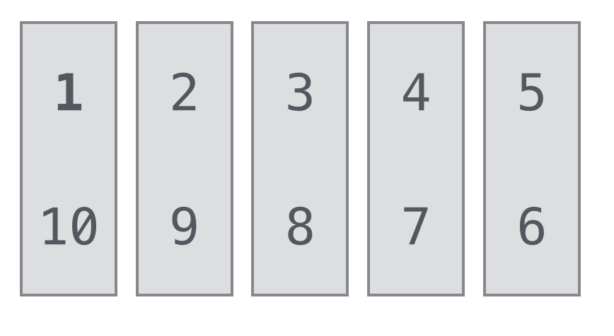
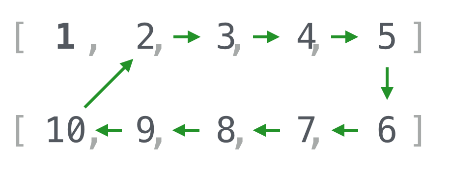
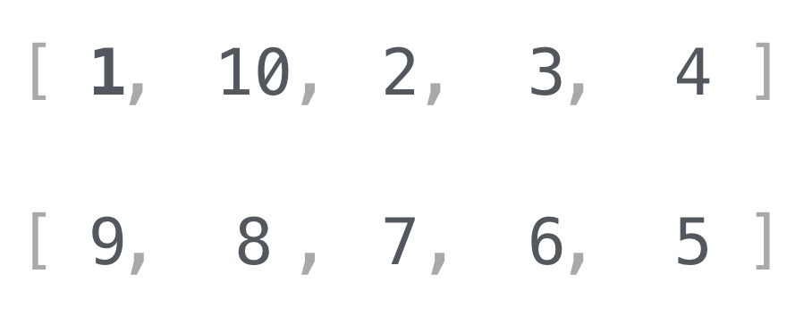
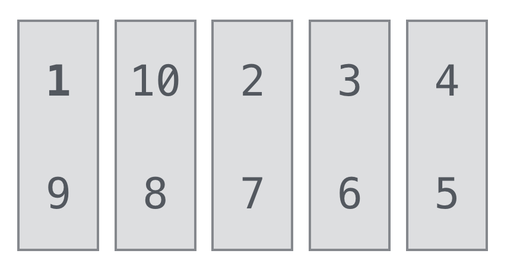

Round-Robin is a way to rotate an array of items such that each item can be paired with every other item exactly once.  In sports, this is a way to ensure that each team plays every other team exactly once.

## Description

Imagine you have an array of 10 teams, and each team has a number:

```
[1,2,3,4,5,6,7,8,9,10]
```

Your goal is to write a function that takes an input array and returns an array of arrays of arrays.

For example, for an array input of `[1,2,3,4]` the result would be:

```
[
  [           // ---- round 1 -----
    [1, 4],   // 1 plays 4
    [3, 2],   // 3 plays 2
  ],
  [           // ---- round 2 -----
    [1, 3],   // 1 plays 3
    [2, 4],   // 2 plays 4
  ],
  [           // ---- round 3 -----
    [1, 2],   // 1 plays 2
    [4, 3],   // 4 plays 3
  ]
]
```

## Algorithm

### 1. Partition and rotate

1. Split the array in half
1. Reverse the second array

The result should look like this:


### 2. Find the matches

Take the first element of the first array, and match it with the first element of the second array, and so on.  Visually, that looks like:



In code, that looks like:

```
[
  [1, 10],
  [2, 9 ],
  [3, 8 ],
  [4, 7 ],
  [5, 6 ],
]
```

### 3. Rotate

* Keep the first element of the first array in its position (it will never change)
* Rotate the other numbers counter-clockwise



Which ends up looking like:



### 4. Find the matches

Take the first element of the first array, and match it with the first element of the second array, and so on.  Visually, that looks like:



```
[
  [1,  9],
  [10, 8],
  [2,  7],
  [3,  6],
  [4,  5],
]
```

### 5. Repeat until all matches have been made

Your round robin function should never return duplicate matches.

## Setup

You will be working in [Jasmine](http://jasmine.github.io/2.3/introduction.html) to solve this problem.

Open `index.html` in a browser to see the tests run.  As you make changes to your round robin js file, hit refresh (CMD+R) in your browser to run the tests again.

## Challenge #1 - LoDash

1. Install [LoDash](https://lodash.com/) in index.html
1. Use [LoDash Methods](https://lodash.com/docs), write code to pass specs

## Challenge #2 - Pure JS

1. Create a copy of `index.html`
1. Remove the reference to LoDash
1. Create a new function `roundRobinPure` and solve it with pure JS

## Challenge #3 - Add UI

In a separate file called `ui.html` create an HTML page that:

1. Loads up jQuery
  * Can you load it from the CDN?
  * From Bower?
1. Has a textarea where users can enter a list of teams, separated by newlines
1. Has a button that users can click to generate a schedule
1. When the button is clicked, print the schedule according to the wireframe
1. When the button is clicked again, clear the previous schedule, and recreate


NOTE: use custom CSS for this - no frameworks.

## Challenge #4 - Solve w/ recursion

'nuff said.

## Resources

* http://en.wikipedia.org/wiki/Round-robin_tournament#Scheduling_algorithm
